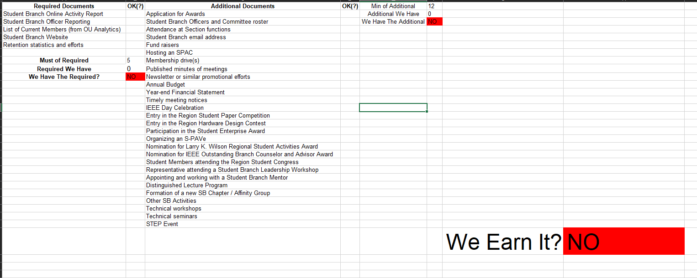
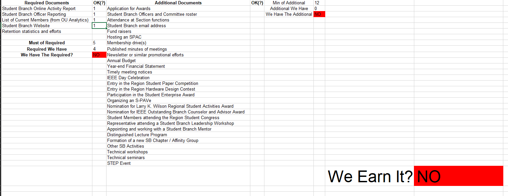
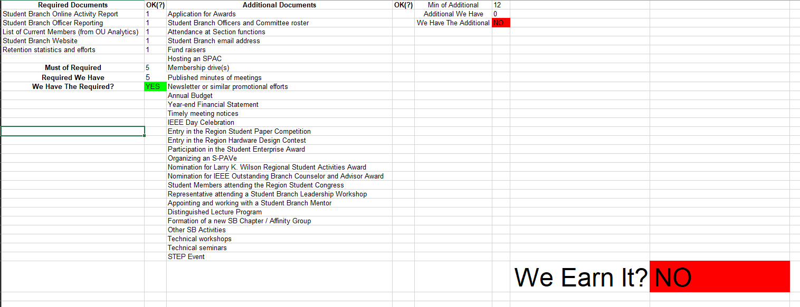
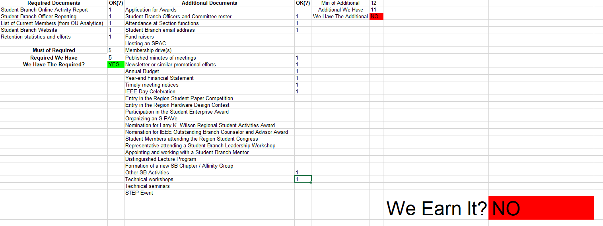
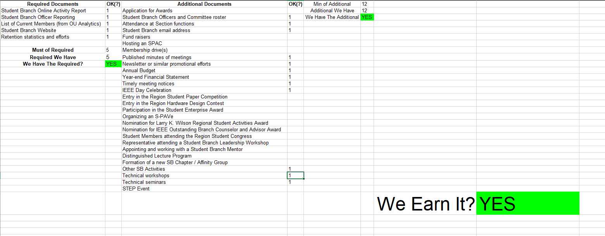

# IEEE SB Award Checklist
A Simple Spreadsheet with IEEE Exemplary Student Branch Award Documents as Checklist!

# Screenshots
Without any document

With some required documents

With all required documents

With some additional documents

Award Earned

# Bug Report
If you have found some bugs or missing documents, please create a issue and/or 
create a pull request (if you have a fixed version).

# Disclaimer
This is a unofficial award checklist/calculator, we cannot guarantee the award.
For more details visit the [official website](https://students.ieee.org/awards).

# Credits
Developed from [Iordanis Kostelidis](mailto:Kostelidis@IEEE.org) for
IEEE Student Branch - International Hellenic University (Serres).

You can use it for your branch freely :D
